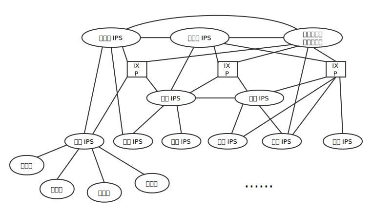
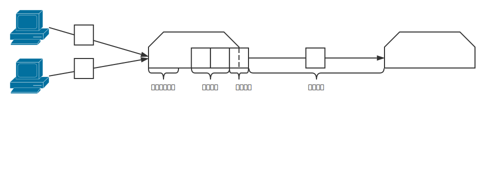
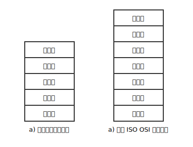
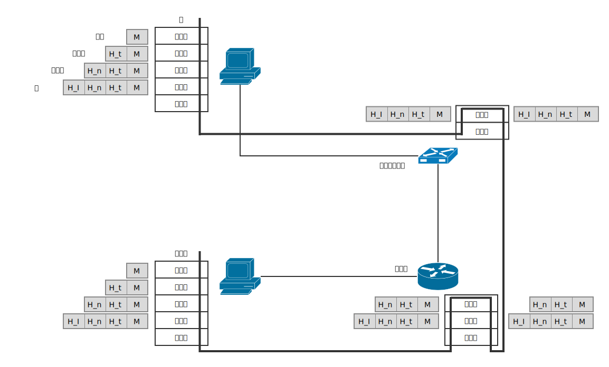

# 计算机网络和因特网

## 网络结构

* 第一层 IPS（tier-1 IPS）
* 区域 IPS（reginal IPS）
* 接入 IPS（assess IPS）
* 端系统（end system）
* 存在点（Point of Presence, PoP）
* 多宿（multi-home）、对等（peer）
* 因特网交换点（Internet Exchange Point, IXP）
* 内容提供商网络（content provider network）

## 分组交换网中的时延

### 结点总时延

结点总时延（total nodal delay）

* 结点处理时延（nodal processing delay）
* 排队时延（queuing delay）
* 传输时延（transmission delay）
* 传播时延（propagation delay）

### 流量强度

a: 分组到达队列的平均速率

R: 从队列中推出比特的速率

L: 所有分组都是由 L 比特组成的

比率 La/R 被称为流量强度（traffic intensity）

设计系统时流量强度不能大于 1

### 计算机网络中的吞吐量

吞吐量（throughput）取决于数据流过的链路的传输速率。没有其他干扰流量时，其吞吐量能够近似为沿着源和目的地之间路径的最小传输速率。如果许多其他的数据流也通过这条链路流动，一条具有高速传输速率的链路仍然可能成为文件传输的瓶颈链路（bottleneck link）。

## 协议层次及其服务模型

### 协议分层

1.应用层

应用层是网络应用程序及它们的应用层协议存留的地方。应用层协议包括 HTTP、SMTP、FTP。域名系统（DNS）也位于应用层。

应用层协议分布在多个端系统上，一个端系统中的应用程序使用协议与另一个端系统中的应用程序交换信息的分组。我们把这种位于应用层的信息分组称为报文（message）。

2.运输层

因特网的运输层在应用程序端点之间传送应用层报文。在因特网中，有两个运输协议，即 TCP 和 UDP，利用其中的任一个都能运输应用层报文。我们把运输层分组称为报文段（segment）。

| 运输协议 | TCP | UDP |
| :---: | :---: | :---: |
| 服务类型 | 面向连接的服务 | 无连接的服务 |
| 可靠性 | ✔️ | ✖️ |
| 链路控制 | ✔️ | ✖️ |
| 拥塞控制 | ✔️ | ✖️ |

3.网络层

因特网的网络层负责将称为数据报（datagram）的网络层分组从一台主机移动到另一台主机。在一台源主机中的因特网运输层协议（TCP 或 UDP）向网络层递交运输层报文段和目的地址。

因特网的网络层包括著名的 IP 协议，该协议定义了在数据报中的各个字段以及端系统和路由器如何作用于这些字段。仅有一个 IP 协议，所有具有网络层的因特网组件必须运行 IP 协议。因特网的网络层也包括决定路由的路由选择协议，它使得数据报根据该路由从源传输到目的地。因特网具有许多路由选择协议。

4.链路层

因特网的网络层通过源和目的地之间的一系列路由器路由数据报。为了将分组从一个结点移动到路径上的下一个结点，网络层必须依靠该链路层的服务。特别是在每个结点，网络层将数据报下传给链路层，链路层沿着路径将数据报传递给下一个结点。在下一个结点，链路层将数据报上传给网络层。我们把链路层分组称为帧（frame）。

由链路层提供的服务取决于应用于该链路的特点链路层协议。链路层的例子包括以太网、WiFi 和电缆接入网的 DOCSIS 协议。因为数据报从源到目的地传送通常需要经过几条链路，一个数据报可能被沿途不同链路上的不同链路层协议处理。网络层将收到来着每个不同的链路层协议的不同服务。

5.物理层

虽然链路层的任务是将整个帧从一个网络元素移动到邻近的网络元素，而网络层的任务是将该帧中的一个一个比特从一个结点移动到下一个结点。在这层中的协议仍然是链路层相关的，并且进一步与该链路的实际传输媒体相关。例如，以太网具有许多物理层协议：关于双绞铜线的，关于同轴电缆的，关于光纤的，等等。在每种场合中，跨越这些链路移动一个比特是以不同的方式进行的。

### OSI 模型

OSI 参考模型附加了两层 -- 表示层和会话层。

表示层的作用是使通信的应用程序能够理解交换数据的含义。这些服务包括数据和数据加密以及数据描述。

会话层提供了数据交换定界和同步功能，包括了建立检查点和恢复方案的方法。

### 封装

## 面对攻击的网络

1.经因特网将有害程序放入你的计算机中

* 病毒是一种需要某种形式的用户交互来感染用户设备的恶意软件。
* 蠕虫是一种无需任何明显用户交互就能进入设备的恶意软件。

2.攻击服务器和网络基础设施

拒接服务攻击（Denial-of-Service（DoS）attack），DoS 攻击使得网络、主机或其他基础设施部分不能由合法用户所使用。大多数因特网 Dos 攻击属于下列三种类型之一：

* 弱点攻击：这涉及向一台目标主机上运行的易受攻击的应用程序或操作系统发送制作精细的报文。如果适当顺序的多个分组发送给一个易受攻击的应用程序或操作系统，该服务器可能停止运行，或者更糟糕的是主机可能崩溃。
* 带宽洪泛：攻击者向目标主机发送大量的分组，分组数量之多使得目标的接入链路变得拥塞，使得合法的分组无法到达服务器。
* 连接洪泛：攻击者在目标主机中创建大量的半开或全开 TCP 连接。该主机因这些伪造的连接而陷入困境。并停止接受合法的连接。

分布式 DoS（Distributed DoS, DDoS）中，攻击者控制多个源并让每个源向目标猛烈发送流量。

3.嗅探分组

分组嗅探器（package sniffer）是记录每个流经的分组副本的被动接收机，例如：Wireshark。

4.伪装成你信任的人

生成具有任意源地址、分组内容和目的地址的分组，然后将这个人工制作的分组传输到因特网中极为容易，因特网将忠实地将该分组转发到目的地。

IP 哄骗（IP spoofing）是将具有虚假源地址的分组注入因特网的能力，而它只是一个用户能够冒充另一个用户的许多方式中的一种。

端点鉴别是一种使我们能够确信一个报文源自我们认为它应当来自的地方的机制。

## 计算机网络和因特网的历史

| 时间 | 时代 |
| :---: | :---: |
| 1961 ~ 1972 | 分组交换的发展 |
| 1972 ~ 1980 | 专用网络和网络互联 |
| 1980 ~ 1990 | 网络的激增 |
| 20 世纪 90 年代 | 因特网爆炸 |
| 最近 | 一片繁荣 |
